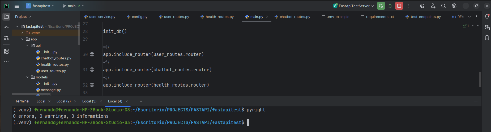
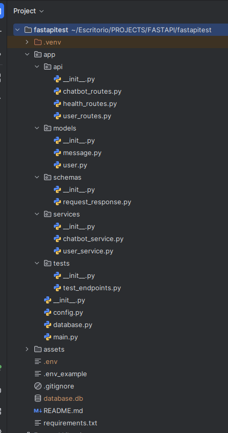
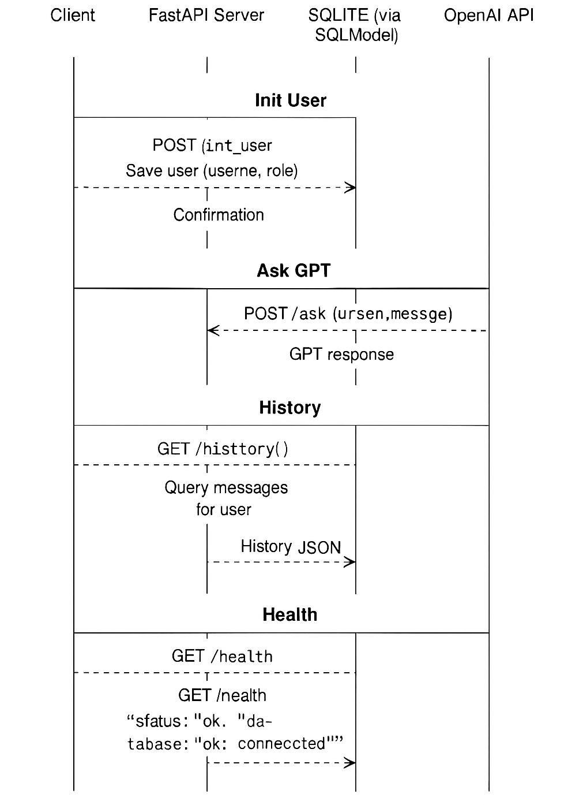

# 🤖 1. GPT Chatbot API – Role-based with FastAPI

This project is a RESTful API built using FastAPI that simulates a configurable chatbot powered by OpenAI. Each user has a role (e.g., "expert in workplace risk assessment") that affects the behavior of the chatbot. The system supports full persistence with SQLite and proper testing and documentation.

---

## 📦 Tech Stack

- ✅ Python 3.10.12
- ✅ FastAPI (REST API + Swagger Docs)
- ✅ SQLModel + SQLite (Persistence)
- ✅ OpenAI API (GPT-3.5)
- ✅ Uvicorn (ASGI Server)
- ✅ Pytest (Unit Testing)
- ✅ Pyright (Static Type Checking)
- ✅ Pydantic (Validation)
- ✅ Dotenv (Environment Variables)

---

## 🚀 Features

- 🧑 Create/update users with roles
- 💬 Chat with GPT using OpenAI API
- 💾 Save full question/answer history per user
- 📡 Health endpoint for DB status
- ✅ Error handling for OpenAI or user errors
- 🧪 Unit tested with mocks for OpenAI
- 📘 Auto-documented with Swagger UI

---

## ⚙️ Getting Started

### 1. Clone the project

```bash
git clone https://github.com/Fer12GV/fastapitest.git
cd fastapitest

```

---


# 2.1  Create virtual environment
```bash
sudo apt update
sudo apt install software-properties-common -y
sudo add-apt-repository ppa:deadsnakes/ppa -y
sudo apt update
sudo apt install python3.10 -y
python3.10 --version

python3.10 -m venv .venv
source .venv/bin/activate  # or .venv\Scripts\activate on Windows
python --version
pip --version

```

---

# 3. Create virtual environment
-- pip install -r requirements.txt

# 4. Configure environment variables
- OPENAI_API_KEY=your_openai_key_here
- OPENAI_API_URL=https://api.openai.com/v1/chat/completions

# 5. Run the API

```bash
uvicorn app.main:app --reload

```

---

Open your browser at:

- 👉 http://127.0.0.1:8000/docs (Swagger UI)
- 👉 http://127.0.0.1:8000/redoc (ReDoc UI)

# 6. API Endpoints

✅ POST /init_user
- Create or update a user with a role.

Request:
{
  "username": "alice",
  "role": "workplace safety expert"
}

✅ POST /ask
- Ask the chatbot a question.

Request:
{
  "username": "alice",
  "message": "What are the main hazards in a factory?"
}

Response:
{
  "username": "alice",
  "question": "...",
  "response": "..."
}

✅ GET /history/{username}
- Returns full chat history for the given user.

✅ GET /health
- Checks if the DB connection is healthy.

---

# 7.❗ Error Handling

| Scenario              | Response                      |
| --------------------- | ----------------------------- |
| User not found        | `404 - User not found`        |
| OpenAI API error      | `404 - User not found`        |
| Invalid input         | `422 - Validation Error`      |
| Internal server error | `500 - Internal server error` |

---

# 8. ✅  Unit Tests
Tests are written using pytest and pytest-mock.

To run:
```bash
pytest

```
```
```
---

# 9. ✔️ Two test cases are included:

- Creating a user

- Asking the chatbot (OpenAI mocked)

Mocking ensures no external API call is made.

---

# 9. ✔️ Static Type Checking
This project uses pyright for type safety.

Run:
```bash
pyright

```
Expected output:
```
0 errors, 0 warnings

```
```
```
# 10. 📸 Screenshot of Pyright output



# 11. 📸 Project Structure



# 12. 📸 Sequence Diagram



# 13. 📘 Technical Notes
- ask_openai() is fully typed and mocked in tests
- Errors are normalized to "User not found" for OpenAI/API failures
- .env isolates secrets from source code
- pyright ensures static type safety
- pytest mocks external requests and isolates logic


#  Docker deployment (Optional)

✅ Requirements
- Docker
- Docker Compose
- Python 3.10+ (already handled inside container)

✅ In your terminal, run:
```bash
docker-compose build
docker-compose up

```
```
```

The FastAPI app will be running at:

http://localhost:8080/docs

You can interact with the Swagger UI to test the endpoints.


# 14. 👨‍💻 Author
Fernando Eliseo Garrido Villalobos
Backend Developer Candidate
📍 Colombia
